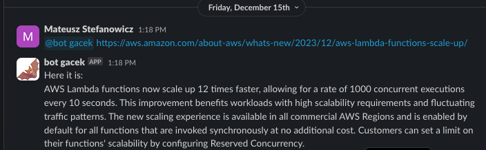

Deploy to Heroku:
```bash
heroku login
heroku create
git remote add heroku https://git.heroku.com/xxxx.git

heroku config:set SLACK_BOT_TOKEN=x
heroku config:set SLACK_SIGNING_SECRET=xx
heroku config:set OPENAI_API_KEY=xxx
heroku config:set GOOGLE_CHROME_BIN=/app/.apt/usr/bin/google-chrome
heroku config:set CHROMEDRIVER_PATH=/app/.chromedriver/bin/chromedriver
git checkout -b main
git add .
git commit -m'Initial commit for my awesome Slack app'
git push heroku main

heroku buildpacks:publish heroku/chromedriver master
heroku buildpacks:publish heroku/google-chrome master
```
There is need to have chrome and chromedriver buildpacks installed on heroku for Selenium

Then to deploy to Heroku is only need to push changes to main branch:


#### App example working on slack
